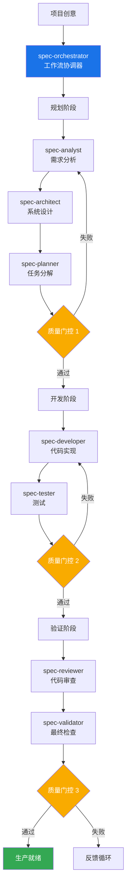

# Claude Sub-Agent Spec 工作流系统

基于 Claude Code Sub-Agents 功能构建的综合性 AI 驱动开发工作流系统。该系统通过协调多个专业化 AI 代理，将项目创意转化为生产就绪的代码。

## 目录

- [概述](#概述)
- [系统架构](#系统架构)
- [安装指南](#安装指南)
- [快速开始](#快速开始)
- [Slash 命令使用](#slash-命令使用)
- [工作原理](#工作原理)
- [Agent 参考](#agent-参考)
- [使用示例](#使用示例)
- [质量门控](#质量门控)
- [最佳实践](#最佳实践)
- [高级用法](#高级用法)
- [故障排除](#故障排除)

## 概述

Spec 工作流系统利用 Claude Code 的 Sub-Agents 功能创建了一个多代理开发流水线。每个代理都是特定领域的专家，负责软件开发生命周期的特定方面，从需求分析到最终验证。

### 核心特性

- **自动化工作流**：从创意到生产代码的完整开发流水线
- **专业化专长**：每个代理专注于其专业领域
- **质量门控**：自动化检查点确保质量标准
- **灵活集成**：可与现有专业代理协同工作
- **全面文档**：每个阶段都生成详细的文档

### 主要优势

- 从概念到代码的开发速度提升 10 倍
- 通过自动化验证确保一致的质量
- 自动生成全面的文档
- 通过系统化流程减少错误
- 通过清晰的工作流程改善协作

## 系统架构



## 安装指南

### 前置要求

- Claude Code（最新版本）
- 已初始化的项目目录
- 对 AI 辅助开发的基本了解

### 安装步骤

1. **下载代理文件**

   ```bash
   # 方式 1：克隆仓库
   git clone https://github.com/zhsama/claude-sub-agent.git
   cd claude-sub-agent
   
   # 方式 2：下载所需的特定代理
   # 单个代理文件可在 agents/ 目录中获取
   ```

2. **复制代理和 slash 命令到项目的 Claude Code 目录**

   ```bash
   # 在你的项目中创建 .claude 目录结构
   mkdir -p .claude/agents
   
   # 从此仓库复制代理
   cp agents/* .claude/agents/
   
   # 复制 slash 命令
   cp commands/agent-workflow.md .claude/commands/
   ```

3. **验证安装**

   你的项目结构应该如下所示：

   ```text
   your-project/
   ├── .claude/
   │   ├── commands/
   │   │   └── agent-workflow.md   # Slash 命令
   │   └── agents/
   │       ├── spec-analyst.md
   │       ├── spec-architect.md
   │       ├── spec-developer.md
   │       ├── spec-orchestrator.md
   │       ├── spec-planner.md
   │       ├── spec-reviewer.md
   │       ├── spec-tester.md
   │       ├── spec-validator.md
   │       └── ... (其他代理)
   └── ... (你的项目文件)
   ```

## 快速开始

### 基本使用

```bash
# 启动新项目工作流
询问 Claude："使用 spec-orchestrator 代理创建一个待办事项 Web 应用"

# 协调器将自动：
# 1. 分析需求
# 2. 设计架构
# 3. 规划任务
# 4. 实现代码
# 5. 编写测试
# 6. 审查和验证
```

### 简单示例

```markdown
你：使用 spec-orchestrator 创建一个个人博客平台

Claude (spec-orchestrator)：正在启动个人博客平台的工作流...

[规划阶段 - 45 分钟]
✓ 需求分析完成
✓ 架构设计完成
✓ 任务规划完成
✓ 质量门控 1：通过 (96/100)

[开发阶段 - 2 小时]
✓ 15 个任务已实现
✓ 测试编写完成
✓ 质量门控 2：通过 (88/100)

[验证阶段 - 30 分钟]
✓ 代码审查完成
✓ 最终验证完成
✓ 质量门控 3：通过 (91/100)

项目完成！生成的产物：
- requirements.md（需求文档）
- architecture.md（架构文档）
- 源代码（15 个文件）
- 测试套件（85% 覆盖率）
- 文档
```

## Slash 命令使用

使用我们的自定义 slash 命令，这是启动完整工作流最快的方式：

### 基本使用

```bash
/agent-workflow "创建一个带用户认证和实时更新功能的任务管理 Web 应用"
```

### 高级使用

```bash
# 高质量企业项目
/agent-workflow "开发一个包含客户管理和分析功能的 CRM 系统" --quality=95

# 快速原型开发
/agent-workflow "简单的个人博客网站" --quality=75 --skip-agent=spec-tester

# 基于现有需求
/agent-workflow "基于现有需求的移动应用" --skip-agent=spec-analyst

# 只运行特定阶段
/agent-workflow "微服务电商平台" --phase=planning
```

### 命令选项

- `--quality=[75-95]`: 设置质量门控阈值
- `--skip-agent=[agent名称]`: 跳过特定的 agent
- `--phase=[planning|development|validation|all]`: 运行特定阶段
- `--output-dir=[路径]`: 指定输出目录
- `--language=[zh|en]`: 文档语言

**📖 完整的 slash 命令文档请参见 [commands/agent-workflow.md](./commands/agent-workflow.md)**

## 工作原理

### 1. Claude Code Sub-Agents 集成

根据 Claude Code 的文档，sub-agents 的工作方式：

- 在隔离的上下文窗口中运行
- 防止主对话的污染
- 允许专业化、聚焦的交互
- 基于任务上下文自动选择

我们的系统通过为每个开发阶段创建专业代理来利用这些特性。

### 2. 工作流阶段

#### 规划阶段

1. **spec-analyst**：分析需求并创建用户故事
2. **spec-architect**：设计系统架构
3. **spec-planner**：将工作分解为任务
4. **质量门控 1**：验证规划完整性

#### 开发阶段

1. **spec-developer**：基于任务实现代码
2. **spec-tester**：编写全面的测试
3. **质量门控 2**：验证代码质量

#### 验证阶段

1. **spec-reviewer**：审查代码最佳实践
2. **spec-validator**：最终生产就绪检查
3. **质量门控 3**：确保部署就绪

### 3. 代理通信

代理通过结构化文档进行通信：

- 每个代理产生特定的文档
- 下一个代理使用前一个的输出作为输入
- 协调器管理整个流程
- 质量门控确保一致性

## Agent 参考

### 工作流代理

| 代理 | 用途 | 输入 | 输出 |
|------|------|------|------|
| spec-orchestrator | 工作流协调 | 项目描述 | 状态报告、路由 |
| spec-analyst | 需求分析 | 用户描述 | requirements.md、user-stories.md |
| spec-architect | 系统设计 | 需求 | architecture.md、api-spec.md |
| spec-planner | 任务规划 | 架构 | tasks.md、test-plan.md |
| spec-developer | 实现 | 任务 | 源代码、单元测试 |
| spec-tester | 测试 | 代码 | 测试套件、覆盖率报告 |
| spec-reviewer | 代码审查 | 代码 | 审查报告、改进建议 |
| spec-validator | 最终验证 | 所有产物 | 验证报告、质量分数 |

### 专业代理

| 代理 | 领域 | 集成点 |
|------|------|--------|
| ui-ux-master | UI/UX 设计 | 规划阶段 |
| senior-backend-architect | 后端系统 | 架构阶段 |
| senior-frontend-architect | 前端系统 | 开发阶段 |
| refactor-agent | 代码质量 | 任何阶段 |

## 使用示例

### 示例 1：企业应用

```bash
# 高质量企业系统
使用 spec-orchestrator，质量阈值设为 95：
创建一个企业 CRM 系统，包含：
- 多租户支持
- 基于角色的访问控制
- RESTful API
- 实时仪表板
- 审计日志
```

### 示例 2：快速原型

```bash
# 快速原型，较低质量阈值
使用 spec-orchestrator，质量阈值 75，跳过分析师：
创建一个简单的落地页，带邮件收集功能
```

### 示例 3：基于现有需求

```bash
# 从现有文档开始
使用 spec-orchestrator 从需求开始：
从 ./docs/requirements.md 加载需求并继续工作流
```

### 示例 4：仅特定阶段

```bash
# 仅对现有代码运行验证
使用 spec-orchestrator 仅进行验证阶段：
验证 ./my-app/ 中的项目
```

## 质量门控

### 门控 1：规划质量（95% 阈值）

- 需求完整性
- 架构可行性
- 任务分解质量
- 用户故事清晰度

### 门控 2：开发质量（80% 阈值）

- 测试覆盖率
- 代码质量指标
- 安全扫描结果
- 性能基准

### 门控 3：生产就绪（85% 阈值）

- 整体质量分数
- 文档完整性
- 部署就绪度
- 运营要求

## 最佳实践

### 1. 项目准备

- 编写清晰的项目描述
- 包含约束和需求
- 指定质量期望
- 提供现有文档

### 2. 与代理协作

- 让每个代理完成其阶段
- 在阶段之间审查产物
- 有效使用反馈循环
- 信任质量门控

### 3. 自定义

- 根据需要调整质量阈值
- 为简单项目跳过代理
- 添加自定义验证标准
- 与现有工作流集成

### 4. 性能优化

- 为大型项目启用并行执行
- 缓存结果用于迭代开发
- 使用特定阶段执行
- 监控资源使用

## 高级用法

### 自定义工作流

```python
# 创建自定义工作流配置
workflow_config = {
    "quality_threshold": 90,
    "skip_agents": ["spec-analyst"],  # 如果你已有需求
    "parallel": True,
    "custom_validators": ["security-scan", "performance-test"],
    "output_format": "markdown"
}

# 使用自定义配置执行
"使用 spec-orchestrator，配置：" + json.dumps(workflow_config)
```

### CI/CD 集成

```yaml
# GitHub Actions 示例
name: AI 工作流验证
on: [pull_request]
jobs:
  validate:
    runs-on: ubuntu-latest
    steps:
      - uses: actions/checkout@v3
      - name: 运行 Spec 验证
        run: |
          # 使用 Claude Code CLI（如果可用）
          claude-code run spec-orchestrator \
            --phase validation \
            --project-path .
```

### 扩展系统

1. **添加新代理**
   - 使用 YAML 前置内容创建代理
   - 定义明确的职责
   - 指定输入/输出格式
   - 更新协调器路由

2. **自定义质量门控**
   - 定义新标准
   - 设置适当的阈值
   - 实现验证逻辑
   - 添加到工作流

3. **领域特定工作流**
   - 创建专门的协调器
   - 定义领域模式
   - 自定义质量标准
   - 针对特定需求优化

## 故障排除

### 常见问题

1. **找不到代理**
   - 验证代理在正确的目录
   - 检查 YAML 前置内容格式
   - 确保适当的文件权限

2. **质量门控失败**
   - 查看失败的具体标准
   - 检查产物完整性
   - 允许代理修改其工作
   - 考虑调整阈值

3. **工作流卡住**
   - 检查协调器状态
   - 查看最后的代理输出
   - 查找错误消息
   - 从最后的检查点重启

### 调试模式

```bash
# 启用详细日志
使用 spec-orchestrator 的调试模式：
创建测试项目并显示所有代理交互
```

## 贡献指南

欢迎贡献！请：

1. 遵循现有的代理格式
2. 添加全面的文档
3. 包含使用示例
4. 与协调器测试
5. 提交带描述的 PR

## 许可证

MIT 许可证 - 详见 LICENSE 文件

## 致谢

- 基于 Claude Code 的 Sub-Agents 功能构建
- 受 BMAD 方法论启发
- 欢迎社区贡献

---

更多信息请参见：

- [Claude Code 文档](https://docs.anthropic.com/en/docs/claude-code)
- [Sub-Agents 指南](https://docs.anthropic.com/en/docs/claude-code/sub-agents)
- [项目问题](https://github.com/zhsama/claude-sub-agent/issues)
