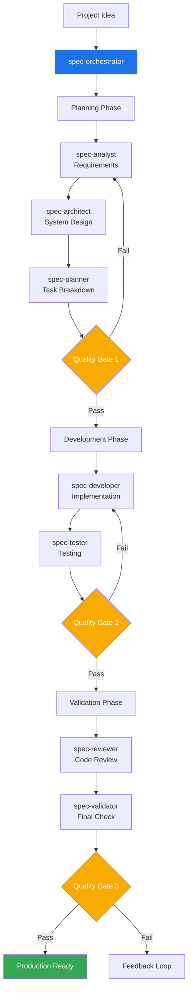

# Claude Sub-Agent Spec Workflow System

A comprehensive AI-driven development workflow system built on Claude Code's Sub-Agents feature. This system transforms project ideas into production-ready code through specialized AI agents working in coordinated phases.

## Table of Contents

- [Overview](#overview)
- [System Architecture](#system-architecture)
- [Installation](#installation)
- [Quick Start](#quick-start)
- [Slash Command Usage](#slash-command-usage)
- [How It Works](#how-it-works)
- [Agent Reference](#agent-reference)
- [Usage Examples](#usage-examples)
- [Quality Gates](#quality-gates)
- [Best Practices](#best-practices)
- [Advanced Usage](#advanced-usage)
- [Troubleshooting](#troubleshooting)

## Overview

The Spec Workflow System leverages Claude Code's Sub-Agents capability to create a multi-agent development pipeline. Each agent is a specialized expert that handles specific aspects of the software development lifecycle, from requirements analysis to final validation.

### Key Features

- **Automated Workflow**: Complete development pipeline from idea to production code
- **Specialized Expertise**: Each agent focuses on their domain of expertise
- **Quality Gates**: Automated checkpoints ensure quality standards
- **Flexible Integration**: Works with existing specialized agents
- **Comprehensive Documentation**: Every phase produces detailed artifacts

### Benefits

- 10x faster development from concept to code
- Consistent quality through automated validation
- Comprehensive documentation generated automatically
- Reduced errors through systematic processes
- Better collaboration through clear workflows

## System Architecture



## Installation

### Prerequisites

- Claude Code (latest version)
- Project directory initialized
- Basic understanding of AI-assisted development

### Setup Steps

1. **Download the agents**

   ```bash
   # Option 1: Clone the repository
   git clone https://github.com/zhsama/claude-sub-agent.git
   cd claude-sub-agent
   
   # Option 2: Download specific agents you need
   # Individual agent files are available in the agents/ directory
   ```

2. **Copy agents and slash command to your project's Claude Code directory**

   ```bash
   # Create .claude directory structure in your project
   mkdir -p .claude/agents .claude/commands
   
   # Copy all agents from categorized directories
   cp -r agents/*/*.md .claude/agents/
   
   # Copy slash command
   cp commands/agent-workflow.md .claude/commands/
   ```

3. **Add RULES to CLAUDE.md**

   ```md
   ## Project Documentation Conventions (Important)

   **Documentation Files:** All new documentation or task files must be saved under the `docs/` folder in this repository.For example:

   - **Tasks & TODOs**: Save in `docs/{YYYY_MM_DD}/tasks/` (e.g., `docs/t2025_08_08/asks/ReleaseTodo.md` for a release checklist).
   - **Requirements/Specs**: Save in `docs/{YYYY_MM_DD}/specs/` (e.g., `docs/2025_08_08/specs/AuthModuleRequirements.md`).
   - **Design Docs**: Save in `docs/{YYYY_MM_DD}/design/` (e.g., `docs/2025_08_08/design/ArchitectureOverview.md`).
   - **Code Files:** Follow the project structure (place new code in the appropriate src/module folder as discussed).
   - **Tests:** Put new test files under the `tests/` directory, mirroring the code structure.

   > **Important:** When creating a new file, ensure the directory exists or create it. Never default to the root directory for these files.
   ```

4. **Verify installation**

   **Repository Structure:**

   ```text
   claude-sub-agent/
   ├── agents/
   │   ├── spec-agents/         # Core workflow agents
   │   │   ├── spec-analyst.md
   │   │   ├── spec-architect.md
   │   │   ├── spec-developer.md
   │   │   ├── spec-orchestrator.md
   │   │   ├── spec-planner.md
   │   │   ├── spec-reviewer.md
   │   │   ├── spec-tester.md
   │   │   └── spec-validator.md
   │   ├── backend/             # Backend specialists
   │   │   └── senior-backend-architect.md
   │   ├── frontend/            # Frontend specialists
   │   │   └── senior-frontend-architect.md
   │   ├── ui-ux/              # Design specialists
   │   │   └── ui-ux-master.md
   │   └── utility/             # Utility agents
   │       └── refactor-agent.md
   └── commands/
       └── agent-workflow.md    # Slash command
   ├── CLAUDE.md
   ```

   **Your project structure after installation:**

   ```text
   your-project/
   ├── .claude/
   │   ├── commands/
   │   │   └── agent-workflow.md   # Slash command
   │   └── agents/
   │       ├── spec-analyst.md
   │       ├── spec-architect.md
   │       ├── spec-developer.md
   │       ├── spec-orchestrator.md
   │       ├── spec-planner.md
   │       ├── spec-reviewer.md
   │       ├── spec-tester.md
   │       ├── spec-validator.md
   │       ├── senior-backend-architect.md
   │       ├── senior-frontend-architect.md
   │       ├── ui-ux-master.md
   │       └── refactor-agent.md
   ├── CLAUDE.md
   └── ... (your project files)
   ```

## Quick Start

### Basic Usage

```bash
# Start a new project workflow
Ask Claude: "Use the spec-orchestrator agent to create a todo list web application"

# The orchestrator will automatically:
# 1. Analyze requirements
# 2. Design architecture
# 3. Plan tasks
# 4. Implement code
# 5. Write tests
# 6. Review and validate
```

### Simple Example

```markdown
You: Use spec-orchestrator to create a personal blog platform

Claude (spec-orchestrator): Starting workflow for personal blog platform...

[Planning Phase - 45 minutes]
✓ Requirements analyzed
✓ Architecture designed
✓ Tasks planned
✓ Quality Gate 1: PASSED (96/100)

[Development Phase - 2 hours]
✓ 15 tasks implemented
✓ Tests written
✓ Quality Gate 2: PASSED (88/100)

[Validation Phase - 30 minutes]
✓ Code reviewed
✓ Final validation complete
✓ Quality Gate 3: PASSED (91/100)

Project complete! Generated artifacts:
- requirements.md
- architecture.md
- Source code (15 files)
- Test suites (85% coverage)
- Documentation
```

## Slash Command Usage

For the quickest way to start a complete workflow, use our custom slash command:

### Basic Usage

```bash
/agent-workflow "Create a task management web application with user authentication and real-time updates"
```

### Advanced Usage

```bash
# High-quality enterprise project
/agent-workflow "Develop a CRM system with customer management and analytics" --quality=95

# Quick prototype development  
/agent-workflow "Simple personal blog website" --quality=75 --skip-agent=spec-tester

# From existing requirements
/agent-workflow "Mobile app based on existing requirements" --skip-agent=spec-analyst

# Specific phases only
/agent-workflow "Microservices e-commerce platform" --phase=planning
```

### Command Options

- `--quality=[75-95]`: Set quality gate threshold
- `--skip-agent=[agent-name]`: Skip specific agents
- `--phase=[planning|development|validation|all]`: Run specific phases
- `--output-dir=[path]`: Specify output directory
- `--language=[zh|en]`: Documentation language

**📖 For complete slash command documentation, see [commands/agent-workflow.md](./commands/agent-workflow.md)**

## How It Works

### 1. Claude Code Sub-Agents Integration

According to Claude Code's documentation, sub-agents work by:

- Operating in isolated context windows
- Preventing pollution of the main conversation
- Allowing specialized, focused interactions
- Being automatically selected based on task context

Our system leverages these features by creating specialized agents for each development phase.

### 2. Workflow Phases

#### Planning Phase

1. **spec-analyst**: Analyzes requirements and creates user stories
2. **spec-architect**: Designs system architecture
3. **spec-planner**: Breaks down work into tasks
4. **Quality Gate 1**: Validates planning completeness

#### Development Phase

1. **spec-developer**: Implements code based on tasks
2. **spec-tester**: Writes comprehensive tests
3. **Quality Gate 2**: Validates code quality

#### Validation Phase

1. **spec-reviewer**: Reviews code for best practices
2. **spec-validator**: Final production readiness check
3. **Quality Gate 3**: Ensures deployment readiness

### 3. Agent Communication

Agents communicate through structured artifacts:

- Each agent produces specific documents
- Next agent uses previous outputs as input
- Orchestrator manages the flow
- Quality gates ensure consistency

## Agent Reference

### Agent Classification System

Our agents are organized into specialized categories for better organization and domain expertise:

- **spec-agents/**: Core workflow orchestration agents
- **backend/**: Backend system specialists
- **frontend/**: Frontend development specialists  
- **ui-ux/**: User experience and design specialists
- **utility/**: General-purpose utility agents

### Core Workflow Agents (spec-agents/)

| Agent | Purpose | Inputs | Outputs |
|-------|---------|--------|---------|
| spec-orchestrator | Workflow coordination | Project description | Status reports, routing |
| spec-analyst | Requirements analysis | User description | requirements.md, user-stories.md |
| spec-architect | System design | Requirements | architecture.md, api-spec.md |
| spec-planner | Task planning | Architecture | tasks.md, test-plan.md |
| spec-developer | Implementation | Tasks | Source code, unit tests |
| spec-tester | Testing | Code | Test suites, coverage reports |
| spec-reviewer | Code review | Code | Review report, improvements |
| spec-validator | Final validation | All artifacts | Validation report, quality score |

### Specialist Agents by Category

#### Backend Specialists (backend/)

| Agent | Domain | Integration Point |
|-------|--------|-----------|
| senior-backend-architect | Backend Systems & Architecture | Architecture/Development phase |

#### Frontend Specialists (frontend/)

| Agent | Domain | Integration Point |
|-------|--------|-----------|
| senior-frontend-architect | Frontend Systems & Architecture | Development phase |

#### UI/UX Specialists (ui-ux/)

| Agent | Domain | Integration Point |
|-------|--------|-----------|
| ui-ux-master | User Experience & Interface Design | Planning/Development phase |

#### Utility Agents (utility/)

| Agent | Domain | Integration Point |
|-------|--------|-----------|
| refactor-agent | Code Quality & Refactoring | Any phase |

## Usage Examples

### Example 1: Enterprise Application

```bash
# High-quality enterprise system
Use spec-orchestrator with quality threshold 95:
Create an enterprise CRM system with:
- Multi-tenancy support
- Role-based access control
- RESTful API
- Real-time dashboard
- Audit logging
```

### Example 2: Quick Prototype

```bash
# Fast prototype with lower quality threshold
Use spec-orchestrator with quality threshold 75 and skip analyst:
Create a simple landing page with email capture
```

### Example 3: Existing Requirements

```bash
# Start from existing documentation
Use spec-orchestrator starting from requirements:
Load requirements from ./docs/requirements.md and continue workflow
```

### Example 4: Specific Phase Only

```bash
# Run only validation on existing code
Use spec-orchestrator for validation phase only:
Validate the project in ./my-app/
```

## Quality Gates

### Gate 1: Planning Quality (95% threshold)

- Requirements completeness
- Architecture feasibility
- Task breakdown quality
- User story clarity

### Gate 2: Development Quality (80% threshold)

- Test coverage
- Code quality metrics
- Security scan results
- Performance benchmarks

### Gate 3: Production Readiness (85% threshold)

- Overall quality score
- Documentation completeness
- Deployment readiness
- Operational requirements

## Best Practices

### 1. Project Preparation

- Write clear project descriptions
- Include constraints and requirements
- Specify quality expectations
- Provide existing documentation

### 2. Working with Agents

- Let each agent complete their phase
- Review artifacts between phases
- Use feedback loops effectively
- Trust the quality gates

### 3. Customization

- Adjust quality thresholds based on needs
- Skip agents for simpler projects
- Add custom validation criteria
- Integrate with existing workflows

### 4. Performance Optimization

- Enable parallel execution for large projects
- Cache results for iterative development
- Use phase-specific execution
- Monitor resource usage

## Advanced Usage

### Custom Workflows

```python
# Create custom workflow configuration
workflow_config = {
    "quality_threshold": 90,
    "skip_agents": ["spec-analyst"],  # If you have requirements
    "parallel": True,
    "custom_validators": ["security-scan", "performance-test"],
    "output_format": "markdown"
}

# Execute with custom config
"Use spec-orchestrator with config: " + json.dumps(workflow_config)
```

### Integration with CI/CD

```yaml
# GitHub Actions example
name: AI Workflow Validation
on: [pull_request]
jobs:
  validate:
    runs-on: ubuntu-latest
    steps:
      - uses: actions/checkout@v3
      - name: Run Spec Validation
        run: |
          # Use Claude Code CLI (if available)
          claude-code run spec-orchestrator \
            --phase validation \
            --project-path .
```

### Extending the System

1. **Add New Agents**
   - Create agent with YAML frontmatter
   - Define clear responsibilities
   - Specify input/output formats
   - Update orchestrator routing

2. **Custom Quality Gates**
   - Define new criteria
   - Set appropriate thresholds
   - Implement validation logic
   - Add to workflow

3. **Domain-Specific Workflows**
   - Create specialized orchestrators
   - Define domain patterns
   - Customize quality criteria
   - Optimize for specific needs

## Troubleshooting

### Common Issues

1. **Agent Not Found**
   - Verify agents are in correct directory
   - Check YAML frontmatter format
   - Ensure proper file permissions

2. **Quality Gate Failures**
   - Review specific criteria that failed
   - Check artifact completeness
   - Allow agents to revise work
   - Consider adjusting thresholds

3. **Workflow Stuck**
   - Check orchestrator status
   - Review last agent output
   - Look for error messages
   - Restart from last checkpoint

### Debug Mode

```bash
# Enable verbose logging
Use spec-orchestrator with debug mode:
Create test project and show all agent interactions
```

## Contributing

We welcome contributions! Please:

1. Follow the existing agent format
2. Add comprehensive documentation
3. Include usage examples
4. Test with the orchestrator
5. Submit PR with description

## License

MIT License - see LICENSE file for details

## Acknowledgments

- Built on Claude Code's Sub-Agents feature
- Inspired by BMAD methodology
- Community contributions welcome

---

For more information, see:

- [Claude Code Documentation](https://docs.anthropic.com/en/docs/claude-code)
- [Sub-Agents Guide](https://docs.anthropic.com/en/docs/claude-code/sub-agents)
- [Project Issues](https://github.com/zhsama/claude-sub-agent/issues)
