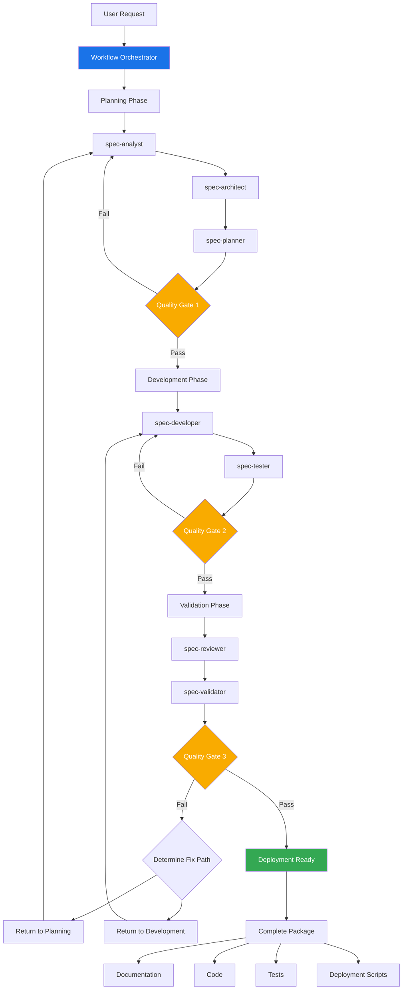

# Spec Agent Workflow System

## Overview

The Spec Agent Workflow System combines BMAD's proven multi-agent architecture with Claude Code's Sub-Agents capability to create an automated, quality-gated development pipeline. This system transforms complex projects from conception to production-ready code through specialized AI agents working in coordinated sequences.

## Core Philosophy

### 1. **Specialized Expertise**

Each agent is a domain expert focused on specific aspects of the development lifecycle, operating in isolated contexts to maintain clarity and prevent cross-contamination of concerns.

### 2. **Document-Driven Workflow**

Every phase produces structured artifacts that serve as inputs for subsequent phases, ensuring traceability and consistency throughout the development process.

### 3. **Quality Gates**

Automated validation checkpoints ensure each phase meets defined quality standards before proceeding, with intelligent feedback loops for continuous improvement.

### 4. **Iterative Excellence**

The system supports both linear progression and iterative refinement, automatically cycling through improvement loops until quality thresholds are met.

## System Architecture



## Agent Roles

### Planning Phase Agents

#### 1. spec-analyst

- **Purpose**: Requirements analysis and project scoping
- **Responsibilities**:
  - Elicit and clarify requirements
  - Create user stories and acceptance criteria
  - Perform market and competitive analysis
  - Generate project brief
- **Outputs**: `requirements.md`, `project-brief.md`, `user-stories.md`

#### 2. spec-architect  

- **Purpose**: System design and technical architecture
- **Responsibilities**:
  - Design system architecture
  - Define technology stack
  - Create component diagrams
  - Plan data models and APIs
- **Outputs**: `architecture.md`, `tech-stack.md`, `api-spec.md`

#### 3. spec-planner

- **Purpose**: Task breakdown and implementation planning
- **Responsibilities**:
  - Create detailed task lists
  - Define implementation order
  - Estimate complexity and effort
  - Plan testing strategy
- **Outputs**: `tasks.md`, `test-plan.md`, `implementation-plan.md`

### Development Phase Agents

#### 4. spec-developer

- **Purpose**: Code implementation
- **Responsibilities**:
  - Implement features based on specifications
  - Follow architectural patterns
  - Write clean, maintainable code
  - Create unit tests
- **Outputs**: Source code files, unit tests

#### 5. spec-tester

- **Purpose**: Comprehensive testing
- **Responsibilities**:
  - Write integration tests
  - Perform end-to-end testing
  - Security testing
  - Performance testing
- **Outputs**: Test suites, test reports

### Validation Phase Agents

#### 6. spec-reviewer

- **Purpose**: Code quality review
- **Responsibilities**:
  - Code review for best practices
  - Security vulnerability scanning
  - Performance optimization suggestions
  - Documentation completeness check
- **Outputs**: `review-report.md`, refactored code

#### 7. spec-validator

- **Purpose**: Final quality validation
- **Responsibilities**:
  - Verify requirements compliance
  - Validate architectural adherence
  - Check test coverage
  - Assess production readiness
- **Outputs**: `validation-report.md`, quality score (0-100%)

### Orchestration Agent

#### 8. spec-orchestrator

- **Purpose**: Workflow coordination and management
- **Responsibilities**:
  - Route tasks to appropriate agents
  - Manage quality gates
  - Handle feedback loops
  - Track overall progress
- **Outputs**: `workflow-status.md`, execution logs

## Quality Gate System

### Gate 1: Planning Quality (After spec-planner)

- **Criteria**:
  - Requirements completeness ≥ 95%
  - Architecture feasibility validated
  - All user stories have acceptance criteria
  - Task breakdown is comprehensive
- **Action**: If fail, return to spec-analyst with specific feedback

### Gate 2: Development Quality (After spec-tester)

- **Criteria**:
  - All tests passing
  - Code coverage ≥ 80%
  - No critical security vulnerabilities
  - Performance benchmarks met
- **Action**: If fail, return to spec-developer with issues list

### Gate 3: Production Readiness (After spec-validator)

- **Criteria**:
  - Overall quality score ≥ 95%
  - All requirements implemented
  - Documentation complete
  - Deployment scripts tested
- **Action**: If fail, determine whether to fix in planning or development phase

## Workflow Commands

### Primary Commands

```bash
# Start a new project workflow
/agent-workflow <project-description>

# Start with existing requirements
/agent-workflow --from-requirements <path/to/requirements.md>

# Start from specific phase
/agent-workflow --phase development --from-artifacts <path/to/artifacts>
```

### Control Commands

```bash
# Check workflow status
/spec-status

# Skip specific agents
/agent-workflow --skip-agents spec-analyst,spec-tester

# Set custom quality thresholds
/agent-workflow --quality-threshold 90

# Enable verbose mode
/agent-workflow --verbose
```

### Phase-Specific Commands

```bash
# Planning only
/spec-plan <project-description>

# Development from existing specs
/spec-develop <path/to/specifications>

# Validation of existing code
/spec-validate <path/to/project>
```

## Integration with Existing Tools

### IDE Integration

- Works with any IDE supporting Claude Code
- Automatic file management and organization
- Real-time progress tracking

### Version Control

- Git-friendly artifact generation
- Automatic commit suggestions
- Branch management recommendations

### CI/CD Pipeline

- Generated test suites ready for CI
- Deployment scripts for various platforms
- Environment configuration files

## Best Practices

### 1. **Project Preparation**

- Clear project description
- Existing documentation (if any)
- Technical constraints defined
- Success criteria established

### 2. **Workflow Execution**

- Let agents complete their phases
- Review artifacts between phases
- Provide feedback when prompted
- Trust the quality gates

### 3. **Customization**

- Adjust quality thresholds based on project needs
- Skip agents for simpler projects
- Add custom validation criteria
- Integrate with existing processes

## Example Usage

### Simple Web Application

```bash
/agent-workflow Create a todo list web app with React frontend and Node.js backend, 
supporting user authentication, task CRUD operations, and real-time updates
```

### Enterprise System

```bash
/agent-workflow --quality-threshold 98 --verbose 
Develop an enterprise resource planning system with microservices architecture, 
supporting inventory management, order processing, and financial reporting
```

### API-Only Service

```bash
/agent-workflow --skip-agents spec-analyst 
--from-requirements ./requirements/api-spec.md
Build a RESTful API service for payment processing with Stripe integration
```

## Advantages Over Traditional Development

### Compared to Manual Development

- **Speed**: 10x faster from concept to code
- **Consistency**: Standardized artifacts and patterns
- **Quality**: Automated quality gates ensure standards
- **Documentation**: Comprehensive docs generated automatically

### Compared to Single AI Agent

- **Expertise**: Specialized agents for each domain
- **Context**: Clean, focused contexts prevent confusion
- **Scalability**: Parallel processing capabilities
- **Reliability**: Quality gates catch issues early

### Compared to BMAD Alone

- **Automation**: Fully automated workflow execution
- **Integration**: Native Claude Code Sub-Agents support
- **Flexibility**: Easy to customize and extend
- **Performance**: Optimized for modern AI capabilities

## Getting Started

1. **Installation**: Save agent files to `.claude/agents/` directory
2. **Configuration**: Adjust quality thresholds in orchestrator
3. **First Project**: Try with a simple project to understand flow
4. **Iterate**: Refine agent prompts based on your needs

## Conclusion

The Spec Agent Workflow System represents the evolution of AI-assisted development, combining the best practices from BMAD's proven methodology with Claude Code's powerful Sub-Agents feature. It transforms the development process from a series of manual steps to an intelligent, automated pipeline that consistently delivers high-quality results.

By leveraging specialized AI agents working in concert, developers can focus on creative problem-solving while the system handles the complexity of coordination, quality assurance, and documentation. The result is faster development cycles, higher code quality, and comprehensive documentation—all with minimal human intervention.

Welcome to the future of AI-driven development, where expertise scales infinitely and quality is guaranteed by design.
