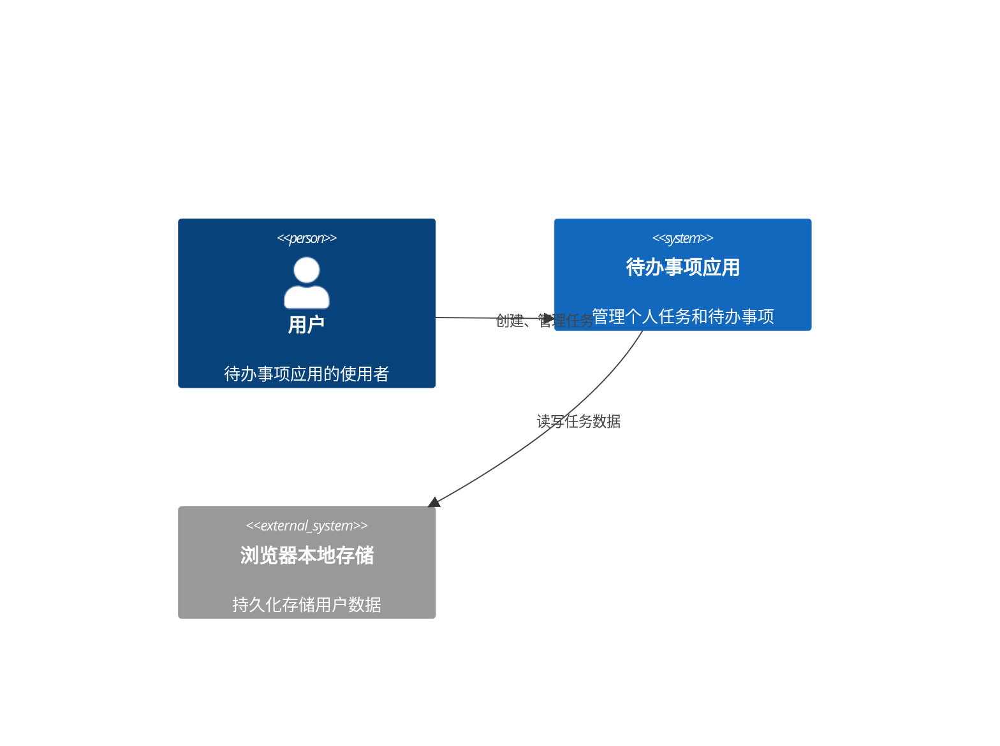
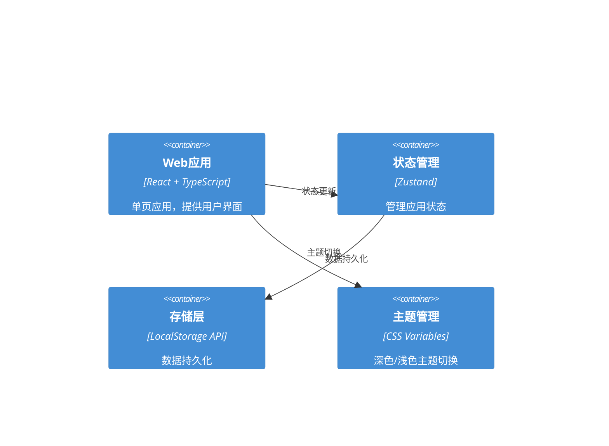
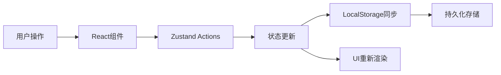

# 待办事项应用系统架构

## 执行摘要

本文档描述了一个现代化的待办事项（Todo）应用的系统架构设计。该应用采用 React + TypeScript 的前端技术栈，实现了完整的任务管理功能，包括标签系统、优先级管理、搜索筛选等特性。系统设计注重用户体验、性能优化和代码可维护性，同时支持响应式设计和深色模式。

## 架构概览

### 系统上下文



### 容器图



## 技术栈

### 前端技术栈

- **框架**: React 18.x
- **语言**: TypeScript 5.x
- **状态管理**: Zustand 4.x
- **样式方案**: CSS Modules + Tailwind CSS
- **构建工具**: Vite 5.x
- **包管理**: pnpm
- **代码规范**: ESLint + Prettier
- **测试框架**: Vitest + React Testing Library

### 开发工具

- **版本控制**: Git
- **代码质量**: Husky + lint-staged
- **提交规范**: Conventional Commits
- **类型检查**: TypeScript strict mode

## 组件设计

### 核心组件架构

```
src/
├── components/           # UI组件
│   ├── TodoList/        # 任务列表组件
│   ├── TodoItem/        # 单个任务组件
│   ├── TodoForm/        # 任务创建表单
│   ├── SearchBar/       # 搜索组件
│   ├── FilterPanel/     # 筛选面板
│   ├── TagManager/      # 标签管理
│   └── ThemeToggle/     # 主题切换
├── hooks/               # 自定义Hooks
│   ├── useTodos.ts      # 任务操作Hook
│   ├── useSearch.ts     # 搜索功能Hook
│   ├── useFilter.ts     # 筛选功能Hook
│   └── useTheme.ts      # 主题管理Hook
├── store/               # Zustand状态管理
│   ├── todoStore.ts     # 任务状态
│   ├── uiStore.ts       # UI状态
│   └── types.ts         # 类型定义
├── services/            # 服务层
│   └── storage.ts       # 本地存储服务
├── utils/               # 工具函数
│   ├── dateUtils.ts     # 日期处理
│   ├── filterUtils.ts   # 筛选逻辑
│   └── validators.ts    # 数据验证
└── types/               # TypeScript类型定义
    └── index.ts         # 全局类型
```

### 组件详细设计

#### TodoList 组件

**用途**: 展示和管理任务列表
**技术**: React.memo 优化、虚拟滚动（大数据量时）
**接口**:

- 输入: 任务数组、筛选条件
- 输出: 渲染任务列表
**依赖**: TodoItem、useTodos Hook

#### TodoForm 组件

**用途**: 创建和编辑任务
**技术**: 受控组件、表单验证
**接口**:

- 输入: 编辑模式标志、现有任务数据（编辑时）
- 输出: 新建/更新任务
**依赖**: 验证工具函数、日期选择器

#### SearchBar 组件

**用途**: 全文搜索功能
**技术**: 防抖优化、实时搜索
**接口**:

- 输入: 搜索关键词
- 输出: 触发搜索
**依赖**: useSearch Hook

#### FilterPanel 组件

**用途**: 多维度筛选任务
**技术**: 组合筛选逻辑
**接口**:

- 输入: 当前筛选条件
- 输出: 更新筛选条件
**筛选维度**:
- 状态（已完成/未完成）
- 优先级（高/中/低）
- 标签
- 日期范围

## 数据架构

### 数据流



### 数据模型

```typescript
// 任务数据模型
interface Todo {
  id: string;                    // 唯一标识符 (UUID)
  title: string;                 // 任务标题
  description?: string;          // 任务描述
  completed: boolean;            // 完成状态
  priority: 'high' | 'medium' | 'low';  // 优先级
  tags: string[];                // 标签数组
  dueDate?: Date;                // 到期日期
  createdAt: Date;               // 创建时间
  updatedAt: Date;               // 更新时间
  completedAt?: Date;            // 完成时间
}

// 标签数据模型
interface Tag {
  id: string;                    // 标签ID
  name: string;                  // 标签名称
  color: string;                 // 标签颜色
  count: number;                 // 使用次数
}

// 筛选条件模型
interface FilterCriteria {
  status?: 'all' | 'completed' | 'incomplete';
  priority?: Priority[];
  tags?: string[];
  dateRange?: {
    start: Date;
    end: Date;
  };
  searchQuery?: string;
}

// 应用状态模型
interface AppState {
  todos: Todo[];
  tags: Tag[];
  filter: FilterCriteria;
  theme: 'light' | 'dark';
  view: 'list' | 'grid';
}
```

### 本地存储架构

```typescript
// LocalStorage 键值设计
const STORAGE_KEYS = {
  TODOS: 'todo-app-todos',
  TAGS: 'todo-app-tags',
  THEME: 'todo-app-theme',
  PREFERENCES: 'todo-app-preferences'
};

// 数据版本控制
interface StorageData<T> {
  version: number;
  data: T;
  lastUpdated: string;
}
```

## 安全架构

### 数据安全

- [x] XSS防护：所有用户输入进行转义处理
- [x] 数据验证：前端输入验证
- [x] 本地存储加密：敏感数据可选加密（未来特性）

### 隐私保护

- [x] 纯前端应用，无服务器数据传输
- [x] 所有数据存储在用户本地
- [x] 支持数据导出和清除功能

## 可扩展性策略

### 性能优化

- **组件懒加载**: 使用 React.lazy 和 Suspense
- **列表虚拟化**: 大量任务时使用虚拟滚动
- **状态优化**: 使用 Zustand 的订阅机制减少不必要的渲染
- **缓存策略**: 搜索结果缓存、计算结果记忆化

### 功能扩展路径

1. **云同步**: 可选的云端备份功能
2. **协作功能**: 任务共享和团队协作
3. **智能提醒**: 基于用户习惯的智能通知
4. **数据分析**: 任务完成趋势和效率分析
5. **插件系统**: 支持第三方扩展

## 部署架构

### 构建配置

```javascript
// vite.config.ts
export default defineConfig({
  build: {
    target: 'es2015',
    minify: 'terser',
    sourcemap: false,
    rollupOptions: {
      output: {
        manualChunks: {
          'react-vendor': ['react', 'react-dom'],
          'utils': ['date-fns', 'uuid']
        }
      }
    }
  }
});
```

### 部署选项

- **静态托管**: Vercel、Netlify、GitHub Pages
- **CDN加速**: CloudFlare、Fastly
- **PWA支持**: Service Worker 离线访问

## 监控与可观测性

### 性能监控

- 首屏加载时间 < 2秒
- 交互响应时间 < 100ms
- 内存使用优化

### 错误追踪

- 全局错误边界
- 错误日志本地存储
- 用户反馈机制

## 架构决策记录（ADRs）

### ADR-001: 选择 Zustand 作为状态管理方案

**状态**: 已采纳
**背景**: 需要一个轻量级但功能完整的状态管理方案
**决策**: 使用 Zustand 替代 Redux
**影响**:

- 更少的模板代码
- 更好的 TypeScript 支持
- 更小的包体积
**备选方案**: Redux Toolkit、Jotai、Valtio

### ADR-002: 使用 LocalStorage 进行数据持久化

**状态**: 已采纳
**背景**: 纯前端应用需要数据持久化方案
**决策**: 使用 LocalStorage API
**影响**:

- 5MB 存储限制
- 同步 API 可能影响性能
- 需要数据序列化
**备选方案**: IndexedDB（复杂度高）、SessionStorage（非持久）

### ADR-003: 采用 CSS Modules + Tailwind CSS

**状态**: 已采纳
**背景**: 需要灵活且可维护的样式方案
**决策**: 结合 CSS Modules 和 Tailwind CSS
**影响**:

- CSS Modules 提供样式隔离
- Tailwind 提供实用类
- 构建时优化未使用的样式
**备选方案**: Styled Components、Emotion、纯 CSS

### ADR-004: 实现虚拟滚动

**状态**: 计划中
**背景**: 大量任务时性能优化需求
**决策**: 当任务数超过 100 时启用虚拟滚动
**影响**:

- 提升大数据量时的性能
- 增加实现复杂度
- 需要固定高度的列表项
**备选方案**: 分页、懒加载

## 未来演进路径

### 阶段 1: MVP (当前)

- 核心 CRUD 功能
- 基础筛选和搜索
- 响应式设计
- 深色模式

### 阶段 2: 增强功能

- 拖拽排序
- 批量操作
- 快捷键支持
- 更丰富的筛选选项

### 阶段 3: 高级特性

- 数据导入/导出
- 任务模板
- 重复任务
- 子任务支持

### 阶段 4: 智能化

- 智能提醒
- 任务建议
- 效率分析
- AI 辅助
